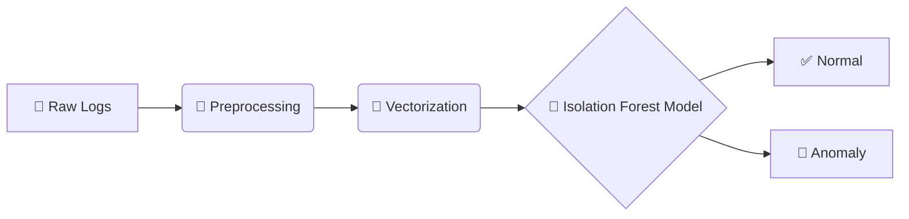

# 🔍 Log Anomaly Detection

A robust system for detecting anomalies in system logs using machine learning. This project leverages **Isolation Forest** to identify unusual patterns in HDFS logs, providing an automated way to monitor system health.

---

## 🚀 Features

- **🧹 Data Preprocessing**: Automated cleaning and structuring of raw log data.
- **🔢 Feature Engineering**: Conversion of log text into numerical vectors using TF-IDF.
- **🧠 Anomaly Detection**: Unsupervised learning with the Isolation Forest algorithm.
- **🖥️ Interactive GUI**: A user-friendly Streamlit application for real-time log analysis.
- **📈 Visualization**: Insightful plots and metrics to understand model performance.

---

## 🏗️ Architecture



---

## 📂 Project Structure

```bash
Log_Anomaly_Detection/
├── 📂 data/          # Raw and processed log data
├── 📂 models/        # Trained models (Isolation Forest, Vectorizer)
├── 📂 notebooks/     # Jupyter notebooks for exploration and training
│   ├── 01_data_exploration.ipynb
│   ├── 02_feature_engineering.ipynb
│   └── 03_model_training.ipynb
├── 📂 results/       # Analysis results and plots
├── 📂 src/           # Source code
│   ├── app.py        # Streamlit GUI application
│   ├── preprocess.py # Data cleaning logic
│   └── ...
├── .gitignore
├── README.md
└── requirements.txt
```

---

## 🛠️ Installation

1.  **Clone the repository:**
    ```bash
    git clone https://github.com/ANAGHAKTP/Log_Anomaly_Detection.git
    cd Log_Anomaly_Detection
    ```

2.  **Install dependencies:**
    ```bash
    pip install -r requirements.txt
    ```

---

## 💻 Usage

### 1️⃣ Train the Model
Run the Jupyter notebooks in the `notebooks/` directory to explore data and train the model. The final model will be saved in the `models/` directory.
- Start with `03_model_training.ipynb` for the training pipeline.

### 2️⃣ Run the Application
Launch the Streamlit interface to test the model with custom log messages:

```bash
streamlit run src/app.py
```

---

## 🤝 Contributing

Contributions are welcome! Please feel free to checkout the `issues` or submit a PR.

---

## 📜 License

This project is licensed under the MIT License.
